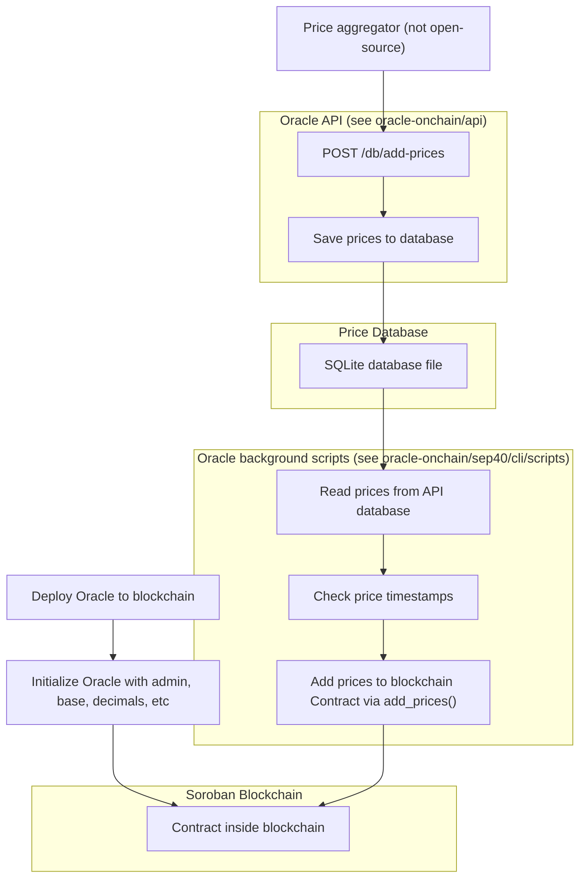

Oracle Deployment:

```mermaid
flowchart TD
    deploy[Deploy Oracle to blockchain]-->initialize[Initialize Oracle with admin, base, decimals, etc]
    initialize-->blockchain_contract
    price_aggregator["Price aggregator (not open-source)"]-->post_prices["POST /db/add-prices"]
    subgraph database [Price Database]
        db[SQLite database file]
    end
    subgraph oracle_api ["Oracle API (see oracle-onchain/api)"]
      post_prices-->save_to_db[Save prices to database]
      save_to_db-->db
    end
    subgraph oracle_background_scripts ["Oracle background scripts (see oracle-onchain/sep40/cli/scripts)"]
      db-->read_prices_from_db[Read prices from API database]
      read_prices_from_db-->check_timestamps[Check price timestamps]
      check_timestamps-->add_prices["Add prices to blockchain Contract via add_prices()"]
    end
    subgraph soroban_blockchain [Soroban Blockchain]
      add_prices-->blockchain_contract[Contract inside blockchain]
    end
```
