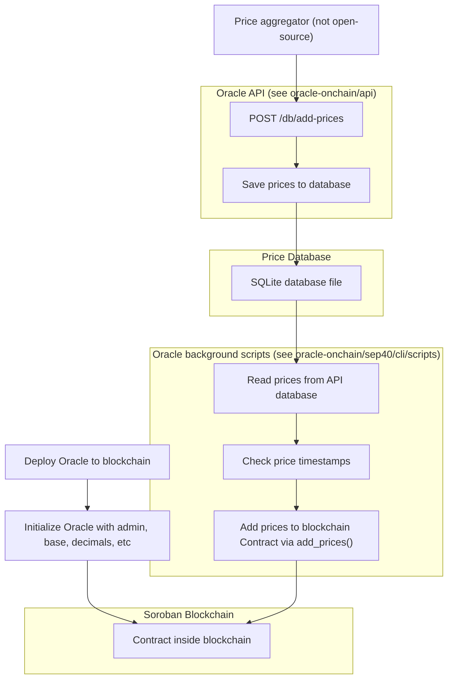

**Lightecho Oracle - Oracle smart contract for Soroban**

Lightecho is a Stellar Oracle for emerging markets data and XLM volatility feeds. Oracles are bridge technologies that connect blockchain systems with the outside world, enabling smart contracts to securely access external data. In the realm of Stellar, a platform designed for the fast and cost-efficient transfer of value across the globe, Lightecho Oracle emerges as a critical tool, especially for Soroban — Stellar's smart contracts platform.

Lightecho is dedicated to delivering real-time, reliable market data and XLM volatility feeds, addressing a significant gap in emerging markets. These markets often face challenges such as limited access to traditional banking services and financial volatility. 

**PRODUCTION** Official Contracts:
- Base `XLM`: [CDOR3QD27WAAF4TK4MO33TGQXR6RPNANNVLOY277W2XVV6ZVJ6X6X42T](https://stellar.expert/explorer/public/contract/CDOR3QD27WAAF4TK4MO33TGQXR6RPNANNVLOY277W2XVV6ZVJ6X6X42T)
- Base `USD`: `not deployed yet`

**TESTNET** Official Contracts:

- Base `XLM`: [CA335SIV2XT6OC3SOUTZBHTX5IXMFO3WYBD3NNVBP37JXX4FXFNF5CI6](https://stellar.expert/explorer/testnet/contract/CA335SIV2XT6OC3SOUTZBHTX5IXMFO3WYBD3NNVBP37JXX4FXFNF5CI6)
- Base `USD`: `not deployed yet`

## Roadmap

- Complete JS examples ( playcode / fiddle updates)
- Improve documentation
- Deploy market data feeds for XLM/EUR, XLM/USD, XLM/ARS, XLM/BRL, XLM/NGN, XLM/NGN_2 and a test of XLM Vol and many more
- Confirm prices resolution
- Improved documentation
- Bounty for usage
- Soroban go live (pilot mode)
- list of initially supported assets
- updates as to data sources 
- architecture and failover (currently a 2 + 1 model)
- licensing


This repository contains:

- Interacting with the Contract (e.g. fetch prices, add prices)
  - Web app
    - [Visit web app](https://bp-ventures.github.io/lightecho-stellar-oracle/)
    - [Web app source code](./docs/v2.html)
  - [Python-based CLI](./oracle-onchain/sep40/cli)
  - [(outdated) A JS fiddle for testing and debugging the contract calls](https://playcode.io/1678393)
  - [(outdated) Example on how to use the Oracle from a consumer contract (in Rust)](./oracle-onchain/sep40/examples/price_up_down)
- Developer tools
  - [Python SDK](./oracle-sdk/python)
  - [JavaScript SDK](./oracle-sdk/javascript)
  - Oracle contract implementation for the Soroban Smart Contracts platform
    - [Contract source code](./oracle-onchain/sep40/contract)
    - [SEP-40 specification](https://github.com/stellar/stellar-protocol/blob/master/ecosystem/sep-0040.md)

## In this README

- [FAQ](#faq)
- [Infrastructure](#infrastructure)
- [Price Sources](#price-sources)
- [A brief timeline of the Lightecho Oracle](#a-brief-timeline-of-the-lightecho-oracle)
- [Roadmap](#roadmap)
- [Featured projects](#featured-projects)

## FAQ

- **What is this repository?**
  This repository is a monorepo that contains multiple software related to
  the Lightecho Oracle, including the Oracle source code itself.
- **What is the Lightecho Oracle?**
  It's BP Venture's implementation of a blockchain oracle for the Stellar blockchain.
  It's built to run in the Soroban network, a smart contracts layer built on the Stellar blockchain.
  [See here](./blockchain_oracle.md) for more details about our motivation.
- **What is the target audience for this repository?**
  Smart contract developers who are looking for Oracle contracts that they can
  integrate into and consume prices from.
- **How do I run this software?**
  Since this repository contains multiple software components, you can run each
  component separately. For example, if you just wanna see the last price in
  the Oracle, check out the [Web app](https://bp-ventures.github.io/lightecho-stellar-oracle/).
  If you want a terminal-based CLI for interacting with the Oracle, check out the [Python CLI](./oracle-onchain/sep40/cli).
  If you're developing a smart contract and you need to fetch an exchange rate, check out [our (outdated) example](./oracle-onchain/sep40/examples/price_up_down)
  on how to consume the Oracle from other contracts. If you want to run the Oracle
  contract, you can run build it and run it locally or deploy to Stellar testnet for example.
  Stellar has [many guides](https://soroban.stellar.org/docs/guides/) that cover a wide range of use cases.

## Infrastructure



## Price Sources

Each source is represented by an integer in the blockchain contract.
To fetch the last price of USD from Coinbase for example, you can use the CLI:

```
./cli oracle lastprice_by_source 1 other USD
```

**TESTNET** Official Sources for prices:

```
0 - BPV aggregator
1 - Coinbase
```

## A brief timeline of the Lightecho Oracle

- **April 2023:** Beginning of development of the Lightecho Oracle.
- **June 2023:** Beginning of development of the Oracle SDKs for Python and JavaScript.
- **July 2023:** First official launch of the Oracle MVP. Internally storing all prices in a single ledger entry of type `Map`.
- **July 2023:** [BPV wins Stellar Community Award for Soroban development](https://p.bpventures.us/blog/lightecho-the-first-ever-emerging-market-oracle,-earns-bpv-the-stellar-community-fund-award/).
- **November 2023:** We began noticing issues related to using `Map` to store the prices in the blockchain.
  The main issue being the size limit for a single ledger entry, and the expensive
  fees consumed to add and retrieve prices from the contract.
- **December 2023:** Started [discussion in Discord](https://discord.com/channels/897514728459468821/1182655940969910294) regarding fees and the use of `Map`.
- **January 2024:** After much discussion, testing, and planning, we decided to rewrite
  the contract using a more lightweight approach: store each price in its own
  dedicated ledger key in temporary storage. Each price ledger key is an integer
  of type `u128` with this structure: `[first 32 bits - source][next 32 bits - asset identifier][next 64 bits - timestamp]`.
  Using this new lightweight approach allowed us to reduce fee costs in **95%** compared
  to the previous implementation using `Map`, and removed all the scalability
  issues we had when using `Map`.
  More curious about the code structure? [See here](https://github.com/bp-ventures/lightecho-stellar-oracle/blob/1377a5ed8270fdd89e0b183ba0007fd6b91d36ae/oracle-onchain/sep40/contract/src/utils.rs#L35) how we generate the ledger key for a given price.
- **January 2024:** Second official launch of the Oracle, now using the new lightweight
  structure to store the prices.
 **March 5 2024:** Lauched the smart contract in Production Pilot [See here] (https://stellar.expert/explorer/public/tx/c74242b939e6d7b492d1297d239807b2cf766d7c1bfaa0286e9ffef63bfb3b9e)
  


#### (For BPV developer) Install the price feed script

The price feed is a script that puts the prices into the blockchain contract.

> [!IMPORTANT]
> CLI must be already setup and configured via `local_settings.py`. See [instructions](./oracle-onchain/sep40/cli).

Start by installing the systemd container:
```bash
sudo apt install systemd-container
```

Now, login into the systemd container and copy the systemd service unit files:
```bash
sudo machinectl shell myusername@  # replace myusername with your Linux username
mkdir -p ~/.config/systemd/user/
cp -v init/systemd/* ~/.config/systemd/user/
```

Go to `~/.config/systemd/user/` and update the `.service` files (that you copied) with the correct paths:
```text
...

[Service]
# replace /path/to/ with the correct path
ExecStart=/path/to/lightecho-stellar-oracle/oracle-onchain/sep40/cli/scripts/bump_instance.sh

...
```

Enable and start the services:
```bash
systemctl --user enable feed_bulk_from_db.timer bump_instance.timer
systemctl --user start feed_bulk_from_db.timer bump_instance.timer
```

Additional commands:
```bash
# to check status
./systemd-status.sh

# to see logs
journalctl --user -u feed_bulk_from_db
journalctl --user -u bump_instance
```

## Featured projects

Have a project that uses our Oracle? Feel free to share with us and we'll be happy to list it here!

---

https://lightecho.io

_Made by BP Ventures_
